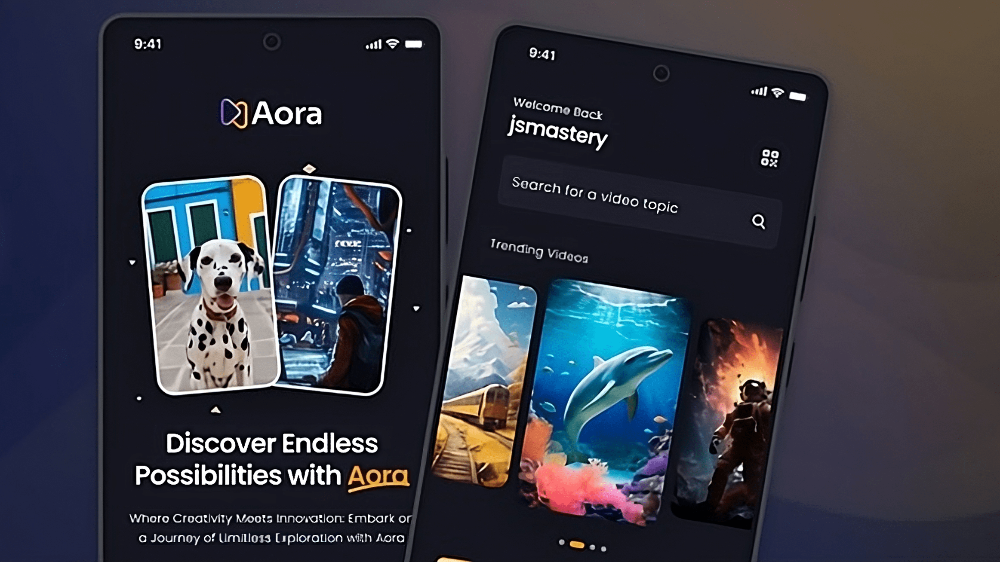

<div align="center">
    <a href="" target="_blank">
      
    </a>
  <h3 align="center">Video Sharing Mobile App</h3>
</div>

##  <br /> 📋 <a name="table">Table of Contents</a>

- ✨ [Introduction](#introduction)
- ⚙️ [Tech Stack](#tech-stack)
- 📝 [Features](#features)
- 🚀 [Quick Start](#quick-start)

##  <br /> <a name="introduction">✨ Introduction</a>

**[EN]** Built with React Native for seamless user experiences, Animatable for captivating animations, and integrated with the dependable backend systems of Appwrite, this app showcases modern design and functionality, enabling seamless sharing of videos within the community.

**[FR]** Construite avec React Native pour une expérience utilisateur fluide, "Animatable" pour des animations captivantes, et intégrée aux systèmes backend fiables d'Appwrite, cette application présente un design moderne et des fonctionnalités facilitant le partage de vidéos au sein d'une communauté.

##  <br /> <a name="tech-stack">⚙️ Tech Stack</a>

- [**React Native**](https://reactnative.dev/docs/getting-started) is a JavaScript framework that enables developers to build mobile applications using React and React-like components. It allows for the development of cross-platform applications that can run on both iOS and Android platforms, leveraging a single codebase.

- [**Expo**](https://docs.expo.dev/) is a comprehensive platform and toolchain built around React Native that accelerates the development of mobile applications. Expo provides a set of tools and services including a development client, build services, and access to native APIs, simplifying the development and deployment process.

- [**Nativewind**](https://www.nativewind.dev/) is a utility library that integrates Tailwind CSS utility classes into React Native development. It brings the ease of use and productivity benefits of Tailwind CSS to mobile app styling, enabling developers to rapidly prototype and style their applications without needing to write traditional CSS.

- [**Animatable**](https://www.npmjs.com/package/react-native-animatable) is a library designed for creating animations in React Native applications with ease. Animatable provides a straightforward API for defining animations such as fades, slides, and transforms, enhancing the visual appeal and user experience of mobile applications.

- [**Appwrite**](https://appwrite.io/docs) is an open-source backend platform that offers a wide range of backend services including authentication, database management, file storage, and cloud functions. It is designed to simplify backend development for web and mobile applications, providing a unified API and robust security features. Appwrite supports scalability and real-time updates, making it suitable for a variety of application use cases.

## <br/> <a name="features">📝 Features</a>

👉 **Onboarding Screen**: Engaging graphics and clear instructions welcome users to the app.

👉 **Robust Authentication & Authorization System**: Secure email login safeguards user accounts.

👉 **Dynamic Home Screen with Animated Flat List**: Smoothly animated flat list showcases the latest videos for seamless browsing.

👉 **Pull-to-Refresh Functionality**: Users can refresh content with a simple pull gesture for up-to-date information.

👉 **Full-Text Search Capability**: Efficiently search through videos with real-time suggestions and instant results.

👉 **Tab Navigation**: Navigate between sections like Home, Search, and Profile with ease using tab navigation.

👉 **Post Creation Screen for Uploading Media**: Upload video and image posts directly from the app with integrated media selection.

👉 **Profile Screen with Detailed Insights**: View account details and activity, including uploaded videos and follower count, for a personalized experience.

👉 **Responsiveness**: Smooth performance and adaptability across various devices and screen sizes for a consistent user experience.

👉 **Animations**: Dynamic animations using the Animatable library to enhance user interaction and engagement throughout the app's UI.


## <br /> <a name="quick-start">🚀 Quick Start</a>

Follow these steps to set up the project locally on your machine.

<br/>**Prerequisites**

Make sure you have the following installed on your machine:

- [Git](https://git-scm.com/)
- [Node.js](https://nodejs.org/en)
- [npm](https://www.npmjs.com/) (Node Package Manager)

<br/>**Cloning the Repository**

```bash
git clone {git remote URL}
```

<br/>**Installation**

Let's install the project dependencies, from your terminal, run:

```bash
npm install
# or
yarn install
```

<br/>**Running the Project**

Installation will take a minute or two, but once that's done, you should be able to run the following command:

```bash
npm start
# or
npx expo start -c
```

Download the [Expo Go](https://expo.dev/go) app onto your device, then use it to scan the QR code from Terminal and run.

Alternatively, you can also use [BlueStacks 5](https://www.bluestacks.com/bluestacks-5.html) to emulate an Android device on your computer.